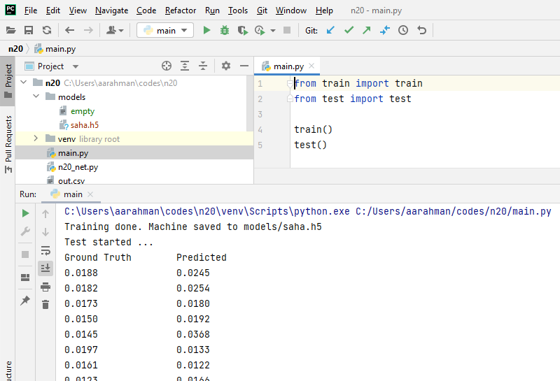

**Background**

This project uses dataset provided by https://doi.org/10.5061/dryad.bnzs7h493.

The original dataset has been refined further by removing unimportant columns and rows with empty values, and saved in saha.csv.

**Install**

pip install -r requirements.txt

**Run**

Run main.py 

**Screenshot**

